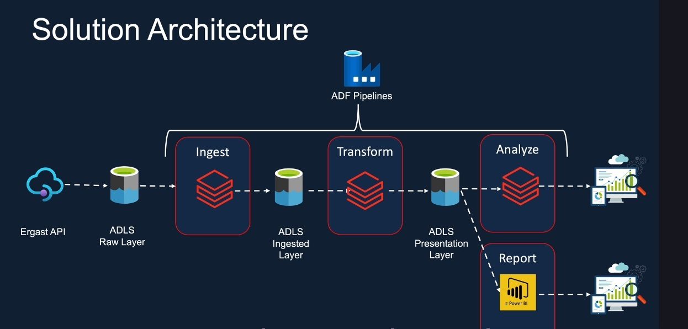

# F1-Azure-Databricks-Pipeline-Ergast-API

## Introduction
This project delivers a scalable data engineering solution on Azure, designed to extract, transform, and load historical F1 race data from the Ergast API. At its core, an Azure Databricks and ADLS Gen2-powered Medallion Lakehouse architecture orchestrates data flow. Utilizing PySpark, Spark SQL, Python, and ADF(Azure Data Factory) to orchestrate data flow. The goal is to refine raw inputs into a clean, optimized gold layer, empowering an interactive Power BI dashboard for deep analytical exploration of the sport.

## Solution Architecture

In this project layered approach, aligning with Medallion Lakehouse pattern used as solution architecture.

1- Bronze Layer (Raw Data Ingestion): The initial step focuses on ingesting raw, historical Formula 1 data from the Ergast API. This process is orchestrated by an Azure Data Factory pipeline, 
   which efficiently retrieves the data and uploads it directly into the raw layer of Azure Data Lake Storage Gen2 (ADLS Gen2). 

2- Silver Layer (Processed Data Ingestion): From the raw data in ADLS, the next step involves processing and refining the data using Azure Databricks notebooks. These notebooks read the raw data, perform initial cleansing and structuring, and then ingest it into the "ingested" or "processed" layer, which is backed by Delta Lake tables within Databricks. This ensures a clean and consistent dataset for further transformations.

3- Gold Layer (Transformed & Business-Ready Data): The final stage transforms the processed data into highly aggregated and business-ready formats, stored as Delta Lake tables in the Gold layer within Azure Databricks. Here, Azure Databricks notebooks apply complex business logic, calculate key metrics, and optimize the data structure for analytical consumption and as input dataset for Power BI dashboard.  

## ETL Process Challenges

1- Ensuring data completeness and updating dataset efficiently in ETL process is one of the challenges. by using Get Metadata activity and 'If condition' logic in Azure Data Factory could handle missing files. by setting up parameters to trigger based on current start date files and folders, ensured only the lates and relevant data was processed in each run

2- managing correct access and permissions, specifically in setting up secure connectivity and access from Databricks File system(DBFS) to ADLS Gen2, and succussfully mounting ADLS Gen2 for seamless data interaction within Databricks. This involved careful configuration of service principals, role-based access control (RBAC), and Databricks secret scopes to ensure secure and efficient data access.

## Technology Used

1. Programming Language - Python, Pyspark
2. Scripting Language - Shell, SQL
3. Modern Data Engineering Platfrom- Databricks
4. Azure Cloud Platform
   - Azure Data Lake Storage Gen2
   - Key vault
   - Azure AD

## Dataset Overview

The project utilized diverse dataset (8 different files) in various formats (JSON, Parquet, CSV). Involved nested data ingestion, handling complex structures within the JSON files. Also, successfully managed multi file ingestion, ensuring complete coverage of F!
historical record.

### More information about dataset:

### Data Model:

